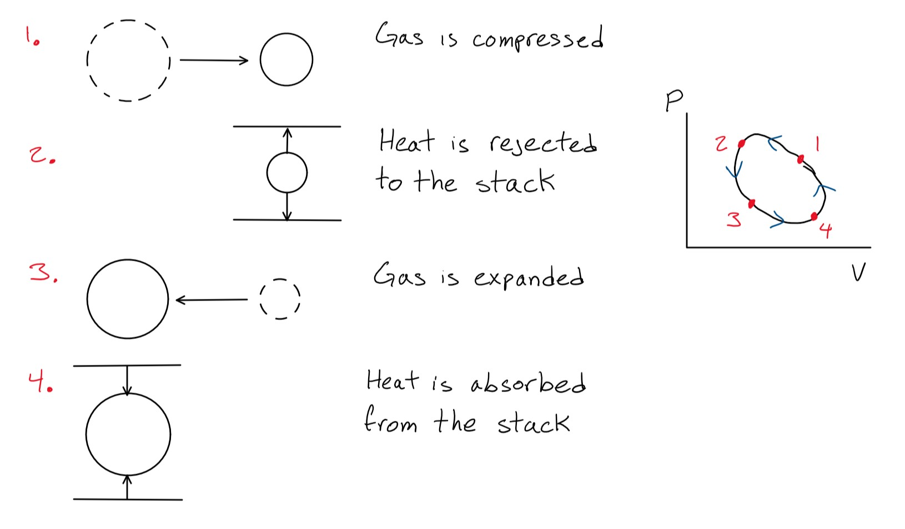
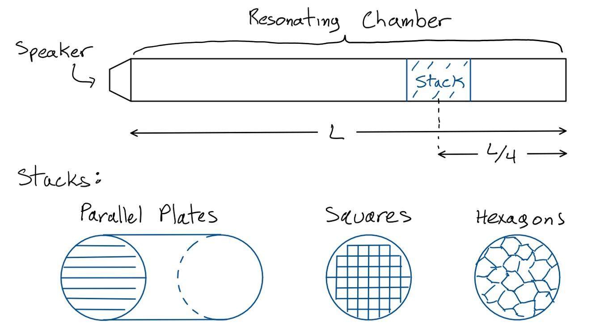

# Thermoacoustics
Projects having to do with thermoacoustic refrigerators (TARs).

The general refrigeration cycle for a thermoacoustic system is as follows:



The acoustic pressure wave compresses and expands the parcel of gas more-or-less adiabatically, then heat is rejected or absorbed more-or-less isobarically.

## Spring 2022 - Advanced Physics Laboratory
This semester we built a half-wavelength cylindrical TAR using a 4' lexan resonator tube and several 3D-printed PLA stacks, each 5cm in length with three differently topologies:

1. parallel plates
2. hexagonal tubes
3. square tubes



This TAR design uses a standing wave to produce a pressure gradient in the resonating chamber, which gives rise to a temperature gradient across the stack using the cycle described above.

**Abstract**

*Thermoacoustic refrigeration is becoming an increasingly popular technique for refrigeration, as it features very few moving parts and replaces toxic refrigerants with nontoxic inert gases. This is particularly good for space-based applications where a refrigerator might be needed somewhere where it is not easily accessible for repairs or may be hazardous to occupants in an enclosed space should the refrigerant escape into the environment. Stack design is central to thermoacoustic refrigeration, with research into the topic being relatively new; in this project, we investigate the efficiency of a standing-wave Thermoacoustic Refrigerator (TAR) using different stack shapes: parallel plates, octagonal tubes, and square tubes.*

*We designed and printed three stacks of equal length made of PLA, using them in our own half-wavelength cylindrical TAR. A tone at a fixed volume is played at the tube’s resonance frequency for five minutes after starting at room temperature, then the temperature difference across the stack is measured with thermometer strips and an IR camera. Preliminary results show the parallel plates achieved the highest temperature difference across the stack, achieving temperature gradients greater than 20°F across the stack. This was followed by the octagonal tubes, with square tubes performing somewhat poorly. Parallel plates are notoriously difficult to manufacture, but with the gaining popularity of 3D printers, this type of stack design is becoming more accessible to both amateur and professional scientists. In the future, we will continue to test the effect of other variables, like stack length or plate spacing.*

### TAR.jl
General scratch work. Because [`Pluto`](https://www.juliapackages.com/p/pluto) is a *reactive* notebook environment, it runs each affected cell again for every change you make. This is good if you're doing something like adjusting one variable and wanting to see how many other things change as a result. It's very useful when taking data or making calculations on-the-fly in a lab setting. It's a lot like Jupyter if you're familiar with that.

Note however that to run this `Pluto` notebook you'll need to first of all install [Julia](https://julialang.org/downloads/), then in the Julia REPL:

```julia
import Pkg
Pkg.add("Pluto")
```

then

```julia
import Pluto
Pluto.run()
```

and you should be able to open up the notebook pretty easily from there - you can even open the notebook directly from its GitHub URL. Pretty neat!

(You can run the .jl file outside of a `Pluto` session, but there is no output.)

### stack_shape.ipynb
This is the notebook where we use our collected data to compare the mean temperature difference across each stack shape (for the 4-inch stacks).

### Scripts
Scratch Python script for calibrating an Adafruit Microphone with an Arduino. The Adafruit microphone is connected to an Arduino UNO, then by connecting the Arduino to your computer with a USB type B cable, you can read the Arduino's output, which we've calibrated to print the voltage of our microphone to COM3. The data from the Adafruit microphone is saved (via PuTTY, which can connect to COM3 and log the session output) to a file called `microphone.log`, which then has to be cleaned using our Python scripts. Actually, I don't think we ended up using any of this...

## Sources

[Thermoacoustic prime movers and refrigerators: Thermally powered engines without moving components](https://trc.nist.gov/cryogenics/Papers/Review/2015-Thermoacoustic_Prime_Movers_and_Refrigerators.pdf), Tao Jin, Jiale Huang, Ye Feng, Rui Yang, Ke Tang, Ray Radebaugh

[Maximum cooling and maximum efficiency of thermoacoustic refrigerators](https://link.springer.com/article/10.1007/s00231-015-1599-y), L.K Tartibu

[PLA Material Data Sheet](https://www.sd3d.com/wp-content/uploads/2017/06/MaterialTDS-PLA_01.pdf)

[Polymer Database (PLA Data)](https://polymerdatabase.com/polymers/polylacticacid.html)

[Isentropic Coefficient of Air](https://www.powderprocess.net/Tools_html/Data_Diagrams/Tools_isentropic_coefficients.html)

[Convert sound pressure in Decibels to Pascals/atm](https://www.translatorscafe.com/unit-converter/en-US/sound-pressure-level/2-9/pascal-sound%20pressure%20level%20in%20decibels/)
